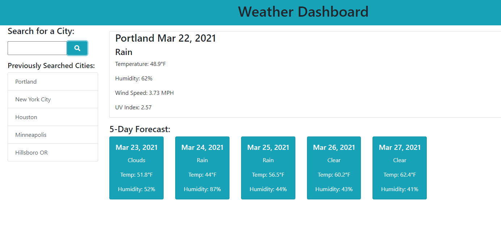

# Weather Dashboard

This app is designed as a weather forecasting dashboard where you can look up a city and see the current day's forecast along with the next five days.

To use the app, simply enter the city you are looking for in the search bar and hit enter or click the search button. The search criteria can include more specific data (an address or zip) than just a city as well. 

After searching, your previous results will show up in a list below the search bar. You can click on any of these locations to search them again. 

Link to the finished product: https://old-prego.github.io/weather-dashboard/

